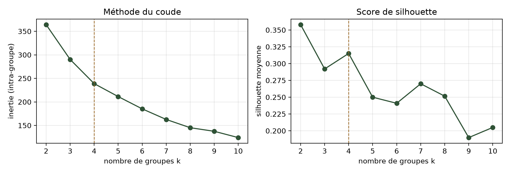
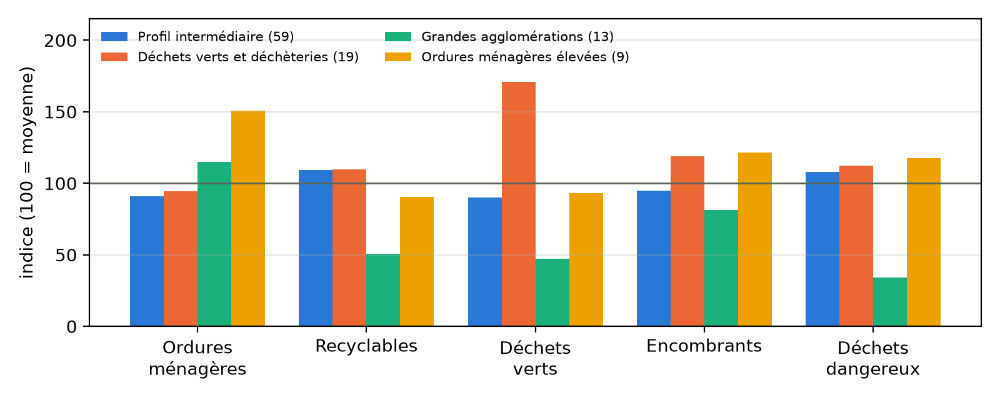
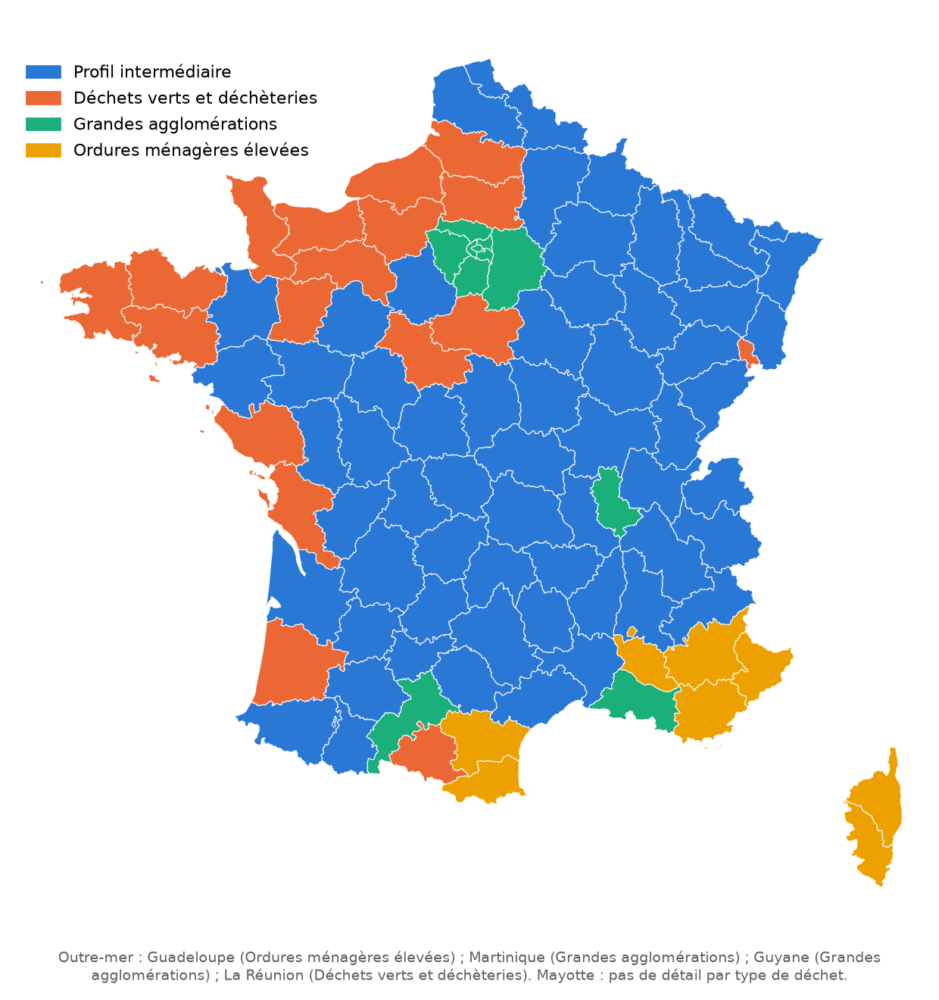

# Clustering — Des profils de départements selon ce que leurs habitants jettent

Apprentissage non supervisé sur les mêmes données que la partie supervisée (ADEME / SINOE, INSEE). Scripts : [`12_clustering_production.py`](scripts/12_clustering_production.py) et [`13_clustering_analyses.py`](scripts/13_clustering_analyses.py) (`make non-supervise`). Rapport détaillé, avec les corrélations, l’ACP et la robustesse : [`rapport/rapport_ML_dechets_clustering.pdf`](rapport/rapport_ML_dechets_clustering.pdf).

## Sommaire

1. [La question posée](#1-la-question-posée)
2. [Étape 1 — Choisir les variables](#2-étape-1--choisir-les-variables)
3. [Étape 2 — Choisir le nombre de groupes : coude et silhouette](#3-étape-2--choisir-le-nombre-de-groupes--coude-et-silhouette)
4. [Étape 3 — Les 4 groupes](#4-étape-3--les-4-groupes)
5. [Limites](#5-limites)
6. [Conclusions](#6-conclusions)

---

## 1. La question posée

En supervisé, on cherchait à **prédire** une valeur connue. Ici, il n'y a pas de réponse attendue : on cherche à **découvrir** des groupes de départements qui se ressemblent.

**Question : existe-t-il des profils types de départements selon la façon dont leurs habitants jettent leurs déchets ?**

## 2. Étape 1 — Choisir les variables

Le clustering regroupe les départements qui se ressemblent *sur les variables qu'on lui donne*. Le choix des variables décide donc de ce que « se ressembler » veut dire.

### Les variables possibles

| Famille | Variables | Ce qu'elles décrivent |
|---|---|---|
| Production | kg par habitant de chaque type de déchet | ce que les habitants jettent |
| Traitement | part incinérée, stockée, recyclée, compostée | ce que le territoire fait de ses déchets |
| Contexte | population, revenu médian | qui est le territoire |

Nous avons retenu la **production**. Le traitement avait déjà été clusterisé dans la partie supervisée (annexe A du rapport). Surtout, mélanger les deux familles compterait deux fois les mêmes informations : les départements qui collectent beaucoup de déchets verts sont aussi ceux qui en compostent beaucoup (corrélation de 0,71), et ceux qui collectent beaucoup de recyclables en recyclent beaucoup (0,63).

### Les 5 variables retenues

| Variable (kg/habitant) | Moyenne | Minimum | Maximum |
|---|---|---|---|
| Ordures ménagères résiduelles (OMR, la poubelle « classique ») | 239 | 135 | 459 |
| Matériaux recyclables | 132 | 21 | 201 |
| Déchets verts et biodéchets | 88 | 1 | 280 |
| Encombrants | 78 | 35 | 122 |
| Déchets dangereux | 10 | 0,2 | 28 |

### Ce qui a été écarté, et pourquoi

| Écarté | Raison |
|---|---|
| Déblais et gravats | Ils viennent surtout des chantiers, pas des habitants (même choix qu'en supervisé) |
| « Autres » | Catégorie presque vide et très irrégulière (coefficient de variation de 1,85) |
| Total de déchets par habitant | C'est la somme des autres : il ferait doublon |
| Population, revenu, traitement | Gardés de côté pour **interpréter** les groupes après coup (variables « illustratives ») |

### Trois choix de mise en forme

- **Des kg par habitant, pas des tonnes**, pour comparer Paris et la Lozère. En tonnes, les départements les plus peuplés écraseraient tout.
- **Une ligne par département.** Les données ont une ligne par département *et par année*. On prend la moyenne des deux enquêtes les plus récentes détaillées par type de déchet, 2019 et 2021 : c'est récent, et ça lisse les variations d'une enquête à l'autre. On obtient **100 départements** (Mayotte n'a pas de détail par type de déchet).
- **Standardisation** (`StandardScaler`, chaque variable ramenée à une moyenne de 0 et un écart-type de 1). Le k-means compare des distances. Sans standardisation, les ordures ménagères (~240 kg) pèseraient 24 fois plus que les déchets dangereux (~10 kg) et décideraient seules des groupes.

## 3. Étape 2 — Choisir le nombre de groupes : coude et silhouette

Le k-means a besoin qu'on lui donne le nombre de groupes **k**. On l'a lancé pour k = 2 à 10, et on a regardé deux indicateurs.

- **La méthode du coude.** L'inertie mesure à quel point les départements sont éloignés du centre de leur groupe. Elle baisse toujours quand on ajoute des groupes. On cherche le « coude » : le point où ajouter un groupe ne fait plus beaucoup baisser l'inertie.
- **Le score de silhouette.** Pour chaque département, il compare la distance aux membres de son groupe et la distance au groupe voisin. Il va de −1 à 1 : proche de 1, le département est bien dans son groupe ; proche de 0, il est à la frontière ; négatif, il serait mieux dans un autre groupe.

| k | Inertie | Baisse de l'inertie | Silhouette | Plus petit groupe |
|---|---|---|---|---|
| 2 | 364 | — | **0,358** | 21 départements |
| 3 | 290 | −20 % | 0,292 | 13 |
| **4** | **239** | **−18 %** | **0,315** | **9** |
| 5 | 211 | −12 % | 0,250 | 10 |
| 6 | 185 | −12 % | 0,241 | **1** |
| 7 | 163 | −12 % | 0,270 | 1 |
| 8 | 145 | −11 % | 0,252 | 1 |
| 9 | 138 | −5 % | 0,190 | 1 |
| 10 | 124 | −10 % | 0,205 | 1 |

### Lecture

- **Le coude est à k = 4.** Passer à 3 puis à 4 groupes fait baisser l'inertie de 20 % puis 18 %. Au-delà, chaque groupe ajouté ne la fait plus baisser que de 10 à 12 %.
- **La silhouette est la plus haute à k = 2 (0,358), puis à k = 4 (0,315)**, qui est un pic local : mieux que 3 et que 5.
- **À partir de k = 6, un groupe ne contient plus qu'un seul département.** Le k-means isole alors un cas extrême, toujours la Guadeloupe, au lieu de former un profil. Ces valeurs de k sont à écarter.

### Décision : k = 4

k = 2 a la meilleure silhouette, mais il ne fait que séparer « les grandes villes et la Méditerranée » du reste de la France : un découpage trop grossier pour apprendre quelque chose. **k = 4 est le seul point où les deux méthodes s'accordent** (coude et pic de silhouette), sans groupe réduit à un département. C'est notre choix.

Le k-means dépend de son point de départ, tiré au hasard : lancé une seule fois, le score de silhouette varie beaucoup d'un tirage à l'autre. Chaque k-means a donc été lancé **20 fois** (`n_init=20`), en gardant le meilleur résultat, avec une graine fixe pour que le résultat soit reproductible.

## 4. Étape 3 — Les 4 groupes

*Indice 100 = moyenne des 100 départements.*

| Groupe | Départements | OMR | Recyclables | Verts | Encombrants | Dangereux | Total* | Silhouette |
|---|---|---|---|---|---|---|---|---|
| Profil intermédiaire | 59 | 217 | 144 | 80 | 74 | 11 | 528 | 0,39 |
| Déchets verts et déchèteries | 19 | 226 | 145 | **151** | **93** | 12 | 629 | 0,14 |
| Grandes agglomérations | 13 | 275 | **67** | **42** | 64 | **3** | **456** | 0,34 |
| Ordures ménagères élevées | 9 | **361** | 120 | 82 | **95** | 12 | **674** | 0,16 |
| *Moyenne nationale* | *100* | *239* | *132* | *88* | *78* | *10* | | |

*kg/habitant. \*Total hors gravats, issu du fichier « chiffres-clés ».*

Pour interpréter les groupes, nous regardons des variables qui **n'ont pas servi** à les former :

| Groupe | Population moyenne | Revenu médian | Incinération | Stockage | Valorisation organique |
|---|---|---|---|---|---|
| Profil intermédiaire | 562 000 | 21 900 € | 21 % | 22 % | 15 % |
| Déchets verts et déchèteries | 592 000 | 21 700 € | 21 % | 18 % | **22 %** |
| Grandes agglomérations | **1 407 000** | **23 000 €** | **49 %** | 16 % | 9 % |
| Ordures ménagères élevées | 500 000 | **20 700 €** | 20 % | **37 %** | 11 % |

### Profil intermédiaire — 59 départements

**Membres :** Haute-Loire, Haute-Vienne, Gers, Ain, Creuse, Allier, Aveyron, Tarn, Doubs, Loire, Jura, Cantal, Saône-et-Loire, Vienne, Isère, Puy-de-Dôme, Haute-Savoie, Meuse, Hautes-Pyrénées, Côte-d'Or, Nord, Tarn-et-Garonne, Indre, Vosges, Ille-et-Vilaine, Moselle, Pyrénées-Atlantiques, Maine-et-Loire, Marne, Nièvre, Indre-et-Loire, Gironde, Bas-Rhin, Drôme, Cher, Corrèze, Haut-Rhin, Savoie, Sarthe, Lozère, Loire-Atlantique, Haute-Marne, Meurthe-et-Moselle, Ardèche, Dordogne, Gard, Yonne, Aube, Ardennes, Lot-et-Garonne, Charente, Deux-Sèvres, Hautes-Alpes, Aisne, Pas-de-Calais, Eure-et-Loir, Hérault, Haute-Saône, Lot.

La France « moyenne » : le Centre, l'Est, le Massif central, une grande partie du Sud-Ouest. Toutes les quantités sont proches de la moyenne, avec un peu moins d'ordures ménagères et un peu plus de recyclables. C'est le groupe le plus cohérent (silhouette de 0,39).

### Déchets verts et déchèteries — 19 départements

**Membres :** Manche, Finistère, Calvados, Mayenne, Landes, Côtes-d'Armor, Oise, Loir-et-Cher, Morbihan, Seine-Maritime, Ariège, La Réunion, Orne, Eure, Somme, Charente-Maritime, Vendée, Loiret, Territoire-de-Belfort.

Surtout le **Grand Ouest** : Bretagne, Normandie, la façade atlantique jusqu'aux Landes. Les déchets verts sont **1,7 fois** plus élevés que la moyenne (151 kg/hab, 280 dans les Landes), et les encombrants sont eux aussi au-dessus. Ce sont des déchets apportés en déchèterie, typiques d'un habitat en maisons avec jardin. Ce groupe est aussi celui qui composte le plus (22 % de valorisation organique) : le traitement suit ce qui est collecté. Hypothèse, non vérifiée avec nos données : la part d'habitat individuel.

### Grandes agglomérations — 13 départements

**Membres :** Seine-Saint-Denis, Hauts-de-Seine, Paris, Val-de-Marne, Val-d'Oise, Martinique, Yvelines, Bouches-du-Rhône, Seine-et-Marne, Guyane, Rhône, Essonne, Haute-Garonne.

**Les 8 départements d'Île-de-France**, plus les départements de Lyon, Marseille et Toulouse. Ils produisent le **moins de déchets au total** (456 kg/hab), mais trient peu : deux fois moins de recyclables et de déchets verts que la moyenne, trois fois moins de déchets dangereux. Leurs ordures ménagères sont un peu au-dessus de la moyenne. Ce sont les plus peuplés (1,4 million d'habitants en moyenne), les plus aisés, et ceux qui incinèrent le plus (49 %). Lecture : habitat collectif, pas de jardin, peu d'accès aux déchèteries ; ce qui n'est pas trié part dans la poubelle ordinaire, puis à l'incinérateur.

La Martinique et la Guyane rejoignent ce groupe pour une autre raison : elles ont aussi peu de tri et peu de déchets verts collectés, mais ce ne sont pas des agglomérations. Le nom du groupe décrit la majorité de ses membres, pas chacun d'eux.

### Ordures ménagères élevées — 9 départements

**Membres :** Var, Corse-du-Sud, Alpes-Maritimes, Haute-Corse, Pyrénées-Orientales, Alpes-de-Haute-Provence, Guadeloupe, Vaucluse, Aude.

**Le pourtour méditerranéen et la Corse.** Les ordures ménagères y sont **1,5 fois** plus élevées que la moyenne (361 kg/hab, 459 en Corse-du-Sud), et c'est le groupe qui produit **le plus de déchets au total** (674 kg/hab). C'est aussi celui qui stocke le plus (37 %, près du double des autres) et dont le revenu médian est le plus bas. Hypothèse : le **tourisme**. Le ratio est calculé avec la population résidente, alors que les touristes produisent des déchets sans être comptés. C'est la même piste que celle ouverte par l'analyse des erreurs du modèle supervisé, où la Corse était le département le plus mal prédit.

## 5. Limites

- **Une structure modérée.** Une silhouette de 0,315 indique des groupes réels mais qui se chevauchent : on n'a pas quatre catégories bien séparées, plutôt un nuage avec des tendances.
- **Deux groupes fragiles.** « Déchets verts » (0,14) et « Ordures ménagères élevées » (0,16) ont une silhouette faible. Quatre départements ont une silhouette négative, c'est-à-dire qu'ils seraient presque aussi bien dans un autre groupe : **Aude, Loiret, Vendée, Territoire-de-Belfort**. Ce sont des cas frontières, à ne pas sur-interpréter.
- **Le k-means est sensible aux valeurs extrêmes.** Les Landes (déchets verts), la Corse-du-Sud (ordures ménagères) ou la Guadeloupe et la Guyane (très peu de recyclables) tirent les centres de leurs groupes.
- **Les départements d'outre-mer** ont des contextes très différents de la métropole (collecte, climat, habitat). Leur présence dans des groupes métropolitains se comprend au regard des chiffres, mais leurs causes sont probablement différentes.
- **Une photo, pas un film.** La moyenne 2019–2021 décrit une situation récente, sans son évolution.
- **Les explications restent des hypothèses.** Habitat avec jardin, habitat collectif, tourisme : les données utilisées ne permettent pas de les vérifier. Il faudrait des variables INSEE sur le logement et le tourisme.

## 6. Conclusions

1. **Les départements se répartissent en 4 profils de production de déchets**, choisis parce que la méthode du coude et le score de silhouette s'accordent sur k = 4, sans groupe réduit à un seul département.
2. **Ces profils sont géographiques**, alors qu'aucune information géographique n'a été donnée au modèle : l'Ouest des déchets verts, les grandes agglomérations, la Méditerranée et la Corse, et une France intermédiaire. Le k-means a retrouvé une géographie à partir des seuls kilos de déchets.
3. **Deux facteurs semblent structurer la carte : le type d'habitat et le tourisme.** Les maisons avec jardin produisent des déchets verts ; l'habitat dense trie moins et produit moins ; les zones touristiques ont des ordures ménagères élevées.
4. **Aucun profil n'est « meilleur » qu'un autre.** Les grandes agglomérations produisent le moins, mais trient le moins. L'Ouest produit beaucoup, mais surtout des déchets verts qu'il composte. Le total seul ne suffit pas à juger un territoire.
5. **Un lien avec la partie supervisée.** Ces profils expliquent les écarts **durables** entre départements, ceux que la valeur de l'enquête précédente capte déjà. Ils ne sont donc pas une piste pour mieux prédire l'évolution d'une enquête à l'autre, mais ils éclairent **pourquoi** les niveaux diffèrent.
6. **Des usages concrets.** Chaque profil appelle une action différente : améliorer le tri en habitat collectif dans les agglomérations, développer le compostage de proximité dans l'Ouest, adapter la collecte aux pics touristiques en Méditerranée.
